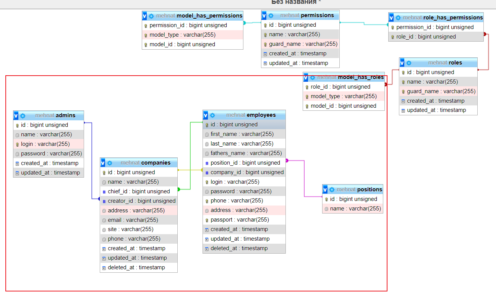

### used in the project

- **[`Php 8`](https://www.php.net/releases/8.0/ru.php#:~:text=PHP%208.0%20%E2%80%94%20%D0%B1%D0%BE%D0%BB%D1%8C%D1%88%D0%BE%D0%B5%20%D0%BE%D0%B1%D0%BD%D0%BE%D0%B2%D0%BB%D0%B5%D0%BD%D0%B8%D0%B5%20%D1%8F%D0%B7%D1%8B%D0%BA%D0%B0,%D1%82%D0%B8%D0%BF%D0%BE%D0%B2%2C%20%D0%BE%D0%B1%D1%80%D0%B0%D0%B1%D0%BE%D1%82%D0%BA%D0%B5%20%D0%BE%D1%88%D0%B8%D0%B1%D0%BE%D0%BA%20%D0%B8%20%D0%BA%D0%BE%D0%BD%D1%81%D0%B8%D1%81%D1%82%D0%B5%D0%BD%D1%82%D0%BD%D0%BE%D1%81%D1%82%D0%B8.)**
- **[`Laravel 8`](https://laravel.com/)**
- **[`jwt-auth`](https://jwt-auth.readthedocs.io/en/develop/laravel-installation/)**
- **[`Laravel-permission`](https://spatie.be/docs/laravel-permission/v5/introduction)**

# In Project
<a href="https://documenter.getpostman.com/view/9990014/UVC8B5ht" target="_blank">
### Awesome README [](https://documenter.getpostman.com/view/9990014/UVC8B5ht)
> <a href="public/Mehnat.uz.pdf" download>documentation Pdf</a>
    
    
> 

#### <b style="color:#35a79c ">Multi-User API Authentication Using Laravel `JWT`(Admin,Employee)</b>

     Login
     logout
     refresh Refresh token

<details><summary><b style="color:#17A2B8">CRUD</b></summary>


> C create
> 
> R read
> 
> U update
> 
> D delete


</details>

<details><summary><b style="color:#355C7D;font-size:20px">Admin</b></summary>

```
- Profile RU
- Admins CRUD --- set role
- Role CRUD
- Position CRUD
- Company CRUD
- Employee CRUD
```

</details>

<details><summary><b style="color:#355C7D;font-size:18px">Employee</b></summary>

```
- Profile RU
- Company R --self company
```

#### <b style="color:#35a79c">Director</b>

```
- Employee CRUD --to self company
- Company RU --self company
```

</details>

<a href="https://documenter.getpostman.com/view/9990014/UVC8B5ht" target="_blank">
public documentation</a>
<p><a href="public/Mehnat.uz.pdf" download>documentation Pdf</a></p>
